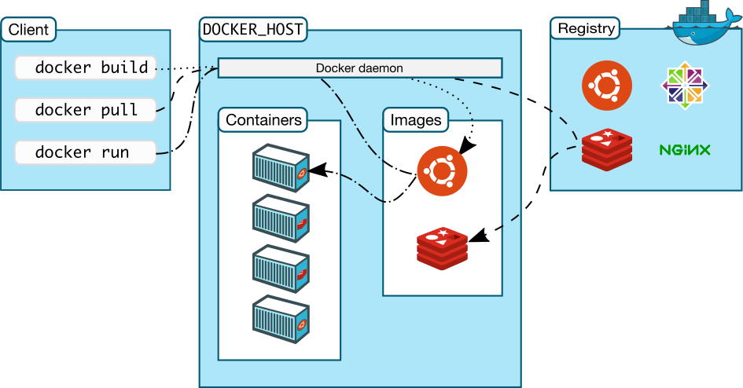
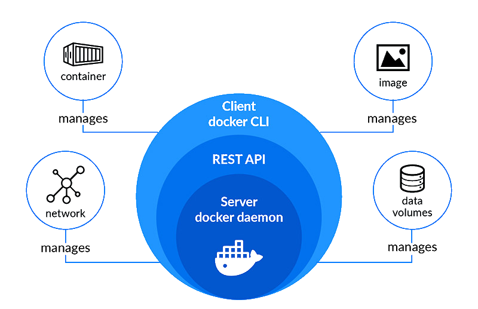
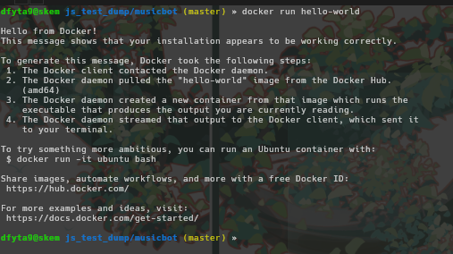
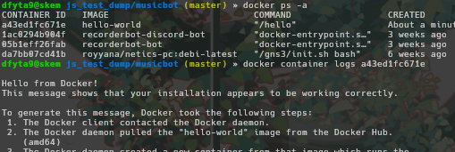

# Deployment

## Apa itu Deployment

Pada konteks dunia IT dan software development, deployment dapat diartikan sebagai sebuah fase pada *software development lifecycle* yang berada setelah fase development dan testing, dan sebelum produk softwarenya available untuk user akhir. Deployment meliputi proses penyiapan dan packaging system software agar dapat digunakan, seperti installation, configuration, running, testing, dsb.

Salah satu contoh dari deployment yang sangat simple dan dimana kalian pasti pernah lakukan adalah deployment sebuah web-application. Setelah kalian telah selesai membuat website baik itu untuk tugas atau portfolio, kalian pasti ingin teman-teman kalian melihatnya kan? Oleh karena itu agar dapat dilihat oleh orang-orang lain kalian harus deploy website tersebut, biasanya ke service seperti vercel, netlify, dsb. Untuk website simple yang masih menggunakan html, css, dan javascript, kita masih bisa drag and drop folder website ke service tersebut karena kesederhanaan teknologi yang digunakan. 

Namun bagaimana cara kita deploy sebuah web-application yang menggunakan berbagai macam teknologi dan library? Solusi dari itu adalah deployment menggunakan **Docker**.

# Docker

## Apa itu Docker

Docker adalah sebuah platform yang memungkinkan pengembang perangkat lunak untuk membuat, mengemas, dan menjalankan aplikasi dalam wadah yang dapat diisolasi secara mandiri, disebut container. Container dalam Docker berfungsi seperti lingkungan eksekusi yang terisolasi untuk menjalankan aplikasi, termasuk kode sumber, runtime, dan dependensi yang diperlukan.


Dengan Docker, pengembang dapat membuat wadah yang konsisten dan portabel, yang dapat dijalankan di berbagai lingkungan komputasi, termasuk mesin lokal, server cloud, atau lingkungan pengembangan dan produksi yang berbeda. Docker memungkinkan aplikasi dan dependensinya diisolasi, sehingga aplikasi dapat dijalankan secara konsisten di berbagai lingkungan tanpa mengganggu host operating system atau aplikasi lainnya.

## Cara Kerja

Docker dapat bekerja menggunakan konsep *containerization*. Konsep ini mirip seperti *virtualization*. Dengan virtualization, kita dapat membuat sebuah mesin virtual di dalam satu fisik server dimana virtualisasi memungkinkan pengelolaan beberapa sistem operasi atau aplikasi yang berjalan secara mandiri. Konsep dasar virtualisasi melibatkan isolasi sumber daya antara mesin virtual, sehingga setiap mesin virtual dapat beroperasi seolah-olah menjadi mesin fisik yang terpisah.

Sedangkan *Containerization* adalah teknologi yang memungkinkan pengemasan aplikasi dan dependensinya ke dalam sebuah wadah (container) yang dapat dijalankan secara konsisten di berbagai lingkungan komputasi, tanpa perlu mengubah kode atau konfigurasi aplikasi itu sendiri. Container merupakan unit yang portabel, ringan, dan dapat diisolasi, yang mengemas aplikasi, library, dan konfigurasi menjadi satu entitas yang dapat dijalankan di lingkungan yang berbeda, seperti lokal, cloud, atau pusat data.

## Virtualization dan Containerization

- Virtualisasi menggunakan hypervisor untuk membuat mesin virtual yang memerlukan sistem operasi penuh dan isolasi sumber daya seperti CPU, RAM, dan storage untuk setiap mesin virtual. Sementara itu, containerization menggunakan teknologi seperti Docker untuk membuat wadah (container) yang berbagi sistem operasi host.

- Virtualisasi memungkinkan menjalankan sistem operasi dan aplikasi yang berbeda secara simultan dalam mesin virtual yang terisolasi. Sementara itu, containerization memungkinkan menjalankan aplikasi yang dikemas dalam container di dalam host yang sama, berbagi kernel OS yang sama.

- Virtualisasi cenderung lebih cocok untuk aplikasi yang membutuhkan isolasi penuh, konfigurasi yang kompleks, dan dukungan untuk berbagai sistem operasi. Di sisi lain, containerization lebih cocok untuk aplikasi yang bersifat ringan, portabel, dan bisa dijalankan di berbagai lingkungan komputasi.

- Proses start-up pada virtualisasi memerlukan waktu yang lebih lama, karena melibatkan booting sistem operasi dan konfigurasi tambahan pada setiap mesin virtual. Containerization, di sisi lain, memungkinkan proses deploy dan start-up yang lebih cepat, karena hanya perlu menjalankan container yang sudah dikemas dan siap dijalankan.

## Arsitektur Docker





### Docker Daemon

Docker Daemon adalah komponen yang berjalan di latar belakang (background) pada host dan bertanggung jawab untuk menjalankan dan mengelola Docker Object seperti images, container, network, dan lain-lain. Docker Daemon adalah proses yang berjalan di dalam sistem operasi host dan menerima perintah dari Docker Client untuk membuat, menjalankan, menghentikan, dan mengelola Docker Object. Docker Daemon juga bertanggung jawab untuk mengelola sumber daya host seperti CPU, memori, dan jaringan yang digunakan oleh Docker Object. Untuk mengaktifkan docker daemon dapat menggunakan command ` sudo systemctl start docker
` jika menggunakan linux atau dengan click icon docker di operating system untuk menyalakan docker jika menggunakan windows/mac.


### Docker Client

Docker Client adalah antarmuka pengguna berbasis command-line atau GUI yang digunakan untuk berinteraksi dengan Docker. Docker Client memungkinkan pengguna untuk menjalankan perintah-perintah Docker untuk membuat, mengelola, dan mengontrol layanan pada Docker. Docker Client berkomunikasi dengan Docker Daemon untuk mengirimkan perintah-perintah Docker dan menerima output layanan Docker yang sedang berjalan.


### Docker Objects

Docker Objects adalah komponen dasar yang terdapat di Docker. Beberapa contoh Docker Objects meliputi image, container, volume, dan network yang akan dijelaskan pada modul selanjutnya. 


### Docker Registry

Docker Registry adalah repositori yang digunakan untuk menyimpan dan berbagi Docker Image. Docker Registry berfungsi sebagai tempat penyimpanan untuk Docker Image yang dapat diakses oleh pengguna Docker dari berbagai lokasi. Docker Hub, yang merupakan Docker public registry, adalah salah satu contoh Docker Registry yang sering digunakan untuk menyimpan dan berbagi Docker Image secara publik. Docker Registry fungsinya mirip seperti github, tetapi untuk image docker. Selain Docker Hub, pengguna juga dapat membuat Docker Registry pribadi untuk menyimpan Docker Image. 


### Docker Service Dasar

#### Docker Container


##### Pengertian Docker Container

Docker Container adalah sebuah unit terisolasi yang berisi perangkat lunak dan semua dependensinya, yang dijalankan pada lingkungan yang terpisah dari host dan container lainnya. Dalam container, aplikasi dapat berjalan dengan konsisten di berbagai lingkungan meskipun terdapat perbedaan dalam konfigurasi dan infrastruktur.


Docker Container bisa diibaratkan seperti kotak berisi program dan semua bahan yang dibutuhkan agar program tersebut bisa berjalan dengan baik. Kotak ini dijalankan secara terpisah dari komputer aslinya, sehingga program dalam kotak ini dapat berjalan dengan konsisten pada berbagai lingkungan tanpa terpengaruh oleh konfigurasi dan infrastruktur yang ada pada komputer aslinya. Dengan Docker Container, developer bisa dengan mudah mengelola dan menjalankan aplikasi di berbagai lingkungan tanpa harus khawatir dengan masalah konfigurasi dan dependensi.


##### Perintah Docker Container

Berikut adalah beberapa perintah penting beserta penjelasannya yang tersedia untuk memanage container pada Docker.

| Perintah  | Deskripsi |
| --------- | --------- |
| `attach` | Menjalankan perintah pada container yang sedang berjalan. Perintah ini akan memasukkan pengguna ke dalam sesi terminal container. |
| `commit` | Membuat sebuah image baru dari perubahan yang dilakukan pada container yang sedang berjalan. |
| `cp` | Menyalin file atau direktori antara file sistem host dan file sistem dalam container. |
| `create` | Membuat sebuah container baru, tetapi tidak menjalankannya. |
| `diff` | Menunjukkan perubahan pada file sistem container yang sedang berjalan. |
| `exec` | Menjalankan sebuah perintah pada container yang sedang berjalan. |
| `export` | Mengekspor sebuah container ke dalam file tar. |
| `inspect` | Melihat detail dari sebuah container. |
| `kill` | Menghentikan sebuah container yang sedang berjalan secara paksa. |
| `logs` | Melihat log dari sebuah container. |
| `ls` | Menampilkan daftar container yang sedang berjalan. |
| `pause` | Menjeda sebuah container yang sedang berjalan. |
| `port` | Menampilkan port yang dibuka oleh sebuah container. |
| `prune` | Menghapus container yang tidak sedang berjalan. |
| `rename` | Mengubah nama dari sebuah container yang sedang berjalan. |
| `restart` | Menghidupkan kembali sebuah container yang sedang berjalan. |
| `rm` | Menghapus sebuah container yang sedang berjalan. |
| `run` | Membuat sebuah container baru dan menjalankannya. |
| `start` | Menjalankan sebuah container yang telah dibuat. |
| `stats` | Menampilkan informasi CPU, memori, dan jaringan dari sebuah container yang sedang berjalan. |
| `stop` | Menghentikan sebuah container yang sedang berjalan. |
| `top` | Menampilkan proses yang sedang berjalan di dalam sebuah container. |
| `unpause` | Meneruskan sebuah container yang telah dijeda. |
| `update` | Memperbarui sebuah container dengan konfigurasi baru. |
| `wait` | Menunggu container selesai menjalankan sebuah perintah sebelum melanjutkan. |

untuk lebih lengkapnya perintah-perintah apa saja yang ada dan serta penjelasannya bisa melihat dokumentasinya dengan menjalankan command **`docker container COMMAND`**

##### Shell di Docker Container

Ketika sebuah container dijalankan, container tersebut berjalan di dalam lingkungan terisolasi yang terpisah dari lingkungan host. Oleh karena itu, tidak mungkin untuk menjalankan perintah langsung di dalam container menggunakan shell host (terminal local).

Untuk menggunakan shell di Docker Container bisa dengan menggunakan perintah **`docker exec [OPTIONS] <CONTAINER> <COMMAND> `** :

- **`docker exec`** digunakan untuk mengeksekusi perintah pada container yang sudah berjalan.
- **`[OPTIONS]`** ada beberapa option yang dapat dipakai dan memiliki fungsi yang berbeda beda.

| Options | Deskripsi |
| -------- | -------- |
| `-d`,`--detach` | Menjalankan perintah di dalam container dalam (detached mode), sehingga container berjalan di latar belakang. |
| `-e`,`--env list` | Mengatur variabel lingkungan (environment variables) pada container. |
| `-i`,`--interactive` | Menjalankan perintah dalam mode interaktif pada container. |
| `-t`,`--tty` | Mengalokasikan pseudo-TTY (TeleTYpewriter) pada container. |
| `-u`,`--user string` | Menentukan pengguna atau UID (user ID) yang akan digunakan untuk menjalankan perintah di dalam container. |
| `-w`,`--workdir string` | Mengatur direktori kerja di dalam container |

- **`<nama_container>`** adalah nama atau ID dari container yang ingin diakses.
- **`<COMMAND>`** adalah command yang akan dijalankan seperti: ls, bash, dan lain lain.

Contoh penggunaan:


```
docker exec -it my_container /bin/sh
```

Perintah di atas akan membuka shell di dalam container dengan nama **`my_container`**. Dengan ini, kita bisa melakukan perintah-perintah shell seperti biasa setelah masuk ke dalam shell tersebut. Untuk keluar dari shell gunakan perintah **`exit`**.

Namun, kita juga bisa melakukan **`docker exec`** tanpa harus masuk kedalam shell di dalam container tersebut.

```
docker exec my_container ls /etc/nginx
```

Perintah di atas akan menampilkan isi dari direktori **`/etc/nginx`** di dalam container dengan nama **`my_container`**.


#### Docker Image


##### Pengertian Docker Image

Docker Image adalah template atau blueprints yang digunakan untuk membuat Docker Container. Image ini berisi sistem operasi dan aplikasi yang sudah dikonfigurasi dengan baik serta siap digunakan. Image dapat dibangun secara manual dengan membuat Dockerfile atau dapat diunduh dari Docker Hub, yaitu repositori publik yang menyediakan banyak image yang sudah siap digunakan.

Docker Image bersifat immutables, artinya setelah dibuat, image tidak bisa diubah secara langsung. Namun, image dapat dibuat baru dengan melakukan modifikasi pada image sebelumnya dan memberikan nama yang berbeda. Setiap image memiliki nama dan tag untuk mengidentifikasinya secara unik. Dalam Docker Hub, nama image biasanya terdiri dari beberapa bagian, seperti nama pengguna (username), nama image, dan tag, seperti contoh **`username/nama_image:tag`**.

Setelah image dibuat, bisa menggunakan perintah **`docker run`** untuk membuat instance dari image tersebut dalam bentuk container.


##### Perintah Docker Image

Berikut adalah beberapa perintah penting beserta penjelasannya yang tersedia pada **`docker image COMMAND`**.

| Perintah  | Deskripsi |
| --------- | --------- |
| `build` |  Perintah ini digunakan untuk membuat sebuah image Docker dari Dockerfile. |
| `history` | Menampilkan riwayat perubahan pada sebuah image. |
| `import` | Mengimpor sebuah image dari sebuah file. File tersebut harus berisi image yang telah diekspor sebelumnya dengan perintah **`docker save`** |
| `inspect` | Melihat detail dari sebuah image. |
| `load` | Memuat sebuah image dari sebuah arsip yang telah disimpan. |
| `ls` | Menampilkan daftar image yang telah terunduh. |
| `prune` | Menghapus image yang tidak terpakai. |
| `pull` | Mengunduh sebuah image dari Docker Hub atau registry lainnya. |
| `push` | Mengunggah sebuah image ke Docker Hub atau registry lainnya. |
| `rename` | Mengubah nama dari sebuah image yang telah terunduh. |
| `rm` | Menghapus sebuah image yang telah terunduh. |
| `save` | Menyimpan sebuah image ke dalam sebuah arsip yang dapat diunduh dengan menggunakan perintah **`docker load`** |
| `tag` | Memberikan sebuah tag pada sebuah image. |

##### Hello-World Docker Image

"Hello World" Docker Image adalah contoh sederhana dari sebuah image yang berisi aplikasi yang sangat sederhana, yaitu hanya mencetak kata "Hello World" pada layar. Image ini digunakan untuk menjelaskan secara singkat tentang bagaimana cara membuat Docker Image, membagikan image ke Docker Hub, serta cara menjalankan Docker Image dalam bentuk container. Image ini juga sering digunakan sebagai langkah awal ketika pertama kali belajar Docker.

Berikut adalah langkah-langkah menggunakan Hello-World Docker Image.

1. Buka terminal atau command prompt dan ketikkan perintah **`docker run hello-world`**. Perintah ini akan mengunduh image "Hello World" dari Docker Hub jika image belum ada di dalam host lokal. Setelah itu, Docker akan menjalankan image tersebut dalam bentuk container dan aplikasi "Hello World" akan berjalan, mencetak kata "Hello from Docker!" pada layar, kemudian menampilkan informasi tambahan tentang Docker.


2. Setelah container selesai berjalan, untuk melihat log dari container tersebut dengan menjalankan perintah **`docker container logs <id_container>`**. Untuk mendapatkan container ID bisa dengan menjalankan perintah **`docker ps -a`**.


3. Setelah selesai, container yang tidak diperlukan dapat dihapus dengan menjalankan perintah **`docker rm <id_container>`**. Selain container, image "Hello World" dapat dihapus dari host lokal dengan menjalankan perintah **`docker rmi hello-world`**.

##### Docker Image Layer

Docker Image layer adalah konsep penting dalam Docker yang memungkinkan pengguna untuk membuat, memperbarui, dan membagikan Docker Image secara efisien. Image layer pada dasarnya adalah file system baca saja yang menyimpan perubahan pada file system pada suatu tahap dalam proses pembuatan Docker Image.

Setiap perubahan yang terjadi pada Docker Image, seperti menambahkan file, memperbarui paket atau mengubah konfigurasi, akan ditambahkan ke layer baru dalam Docker Image. Layer baru ini akan menjadi layer anak dari layer sebelumnya dalam Docker Image, yang berarti bahwa setiap layer akan memiliki layer induk yang berbeda dan akan menambahkan perubahan pada layer sebelumnya.Sehingga, layer image baru hanya menyimpan perubahan yang terjadi pada layer image sebelumnya dan tidak perlu menyimpan seluruh Docker Image. Oleh karena itu, Docker Image terdiri dari beberapa layer yang bersama-sama membentuk sistem file root yang lengkap di dalam container.

Dan nantinya jika dilakukan **`docker run`** pada image akan menambah satu layer, yaitu writable layer yang disebut dengan container layer. Jadi sebuah image tidak dapat melakukan edit kecuali jika membuild image baru dan hanya dapat melakukan edit saat nanti sudah dalam bentuk container.


### Dockerfile

#### Pengertian Dockerfile

Dockerfile adalah file teks yang berisi instruksi untuk membangun sebuah Docker Image. Dalam Dockerfile, dapat menentukan berbagai komponen dan konfigurasi yang diperlukan untuk membuat sebuah image, seperti base image yang digunakan, perintah-perintah yang harus dijalankan, file yang harus di-copy, serta variabel lingkungan yang perlu di-set.

Dockerfile sangat penting dalam membangun sebuah image karena memungkinkan pengguna untuk membuat image dengan cara yang konsisten dan terdokumentasi dengan baik. Dengan Dockerfile, seorang developer dapat mereplikasi pengaturan dan konfigurasi yang sama setiap kali membangun sebuah image, bahkan pada lingkungan yang berbeda-beda.

Selain itu, Dockerfile juga memungkinkan seorang developer untuk menggunakan konsep modularitas dalam membangun image dengan memisahkan komponen-komponen image menjadi layer-layer yang berbeda dalam Dockerfile. Sehingga memungkinkan untuk memperbarui atau mengganti komponen tertentu tanpa harus membangun ulang seluruh image.

Sebagai studi kasus, bayangkan ada seorang web developer yang sedang mengembangkan sebuah aplikasi web dengan menggunakan bahasa pemrograman Python. Aplikasi tersebut memerlukan beberapa library tambahan seperti Flask dan SQLAlchemy, serta database PostgreSQL sebagai back-end.

Jika tidak menggunakan Dockerfile untuk membangun Docker Image untuk aplikasi tersebut, maka developer tersebut harus melakukan instalasi semua library dan dependensi secara manual pada setiap mesin atau lingkungan di mana aplikasi tersebut di-deploy. Hal ini dapat menjadi sangat merepotkan, terutama jika aplikasi memiliki banyak dependensi atau memerlukan konfigurasi yang kompleks.

Dengan menggunakan Dockerfile, developer tersebut dapat menentukan semua dependensi dan konfigurasi yang diperlukan dalam satu file yang dapat di-replikasi pada semua mesin atau lingkungan. Hal ini memudahkan pengembangan dan deployment aplikasi, karena tidak perlu melakukan instalasi manual pada setiap mesin atau lingkungan yang berbeda.

#### Perintah Dockerfile

Berikut adalah beberapa perintah penting beserta penjelasannya yang bisa diimplementasikan pada dockerfile.

| perintah | deskripsi |
| ------------ | ------------ |
| `from` | menentukan base image yang akan digunakan untuk build. |
| `copy` | menyalin file atau folder dari host ke dalam image. |
| `add` | menyalin file atau folder dari host ke dalam image, bisa juga digunakan untuk men-download file dari url dan mengekstraknya ke dalam image. |
| `run` | menjalankan perintah pada layer yang sedang dibangun dan membuat image baru. |
| `cmd` | menentukan perintah default yang akan dijalankan saat container di-start. |
| `entrypoint` | menentukan perintah yang akan dijalankan saat container di-start, dapat juga di-overwrite oleh perintah saat container di-run. |
| `env` | menentukan environment variable di dalam container. |
| `expose` | menentukan port yang akan di-expose dari container ke host. |
| `volume` | menentukan direktori yang akan di-mount sebagai volume di dalam container. |

#### Contoh struktur file Dockerfile

Sebuah Dockerfile terdiri dari sekumpulan instruksi yang dieksekusi secara berurutan dari atas ke bawah, di mana setiap instruksi umumnya akan menghasilkan satu layer baru pada image. Berikut contoh sederhana Dockerfile untuk aplikasi web berbasis Python (Flask):
 
```dockerfile
# Menentukan base image yang digunakan
FROM python:3.11-slim
 
# Menentukan direktori kerja di dalam container
WORKDIR /app
 
# Menyalin file requirements.txt dari host ke dalam image
COPY requirements.txt .
 
# Menjalankan perintah instalasi dependensi
RUN pip install --no-cache-dir -r requirements.txt
 
# Menyalin seluruh source code aplikasi ke dalam image
COPY . .
 
# Menentukan environment variable
ENV FLASK_ENV=production
 
# Menentukan port yang akan di-expose dari container
EXPOSE 5000
 
# Menentukan perintah default yang dijalankan saat container di-start
CMD ["python", "app.py"]
```
 
Penjelasan struktur di atas:
- `FROM` selalu menjadi instruksi pertama yang menentukan base image sebagai fondasi awal pembuatan image.
- `WORKDIR` menentukan direktori kerja di dalam container, sehingga instruksi-instruksi setelahnya (seperti `COPY` dan `RUN`) dieksekusi relatif terhadap direktori tersebut.
- `COPY` digunakan untuk menyalin file secara bertahap; memisahkan `COPY requirements.txt .` dari `COPY . .` bertujuan agar Docker dapat memanfaatkan *layer caching*—instalasi dependensi tidak perlu diulang jika hanya source code yang berubah.
- `RUN` mengeksekusi perintah pada saat proses build, umumnya digunakan untuk instalasi package atau dependensi.
- `ENV` menentukan environment variable yang akan tersedia di dalam container saat berjalan.
- `EXPOSE` bersifat dokumentatif, menandakan port mana yang digunakan aplikasi di dalam container (tidak secara otomatis mem-publish port ke host).
- `CMD` menentukan perintah default yang dijalankan ketika container di-start, dan dapat di-override saat menjalankan `docker run` dengan menambahkan perintah lain di akhir.

> [!IMPORTANT]
> Urutan instruksi pada Dockerfile berpengaruh terhadap efisiensi build. Instruksi yang jarang berubah (seperti instalasi dependensi) sebaiknya diletakkan di bagian atas, sedangkan instruksi yang sering berubah (seperti penyalinan source code) diletakkan di bagian bawah, agar Docker dapat memaksimalkan penggunaan cache layer dan mempercepat proses build.

### Docker Compose

#### Pengertian Docker Compose

Docker Compose adalah alat untuk mendefinisikan dan menjalankan aplikasi multi-kontainer. Alat ini merupakan kunci untuk mewujudkan pengalaman pengembangan dan penerapan (deployment) yang efisien dan lebih lancar, seperti pada aplikasi yang membutuhkan beberapa service sekaligus.

Tanpa Docker Compose, menjalankan aplikasi multi-container berarti harus menjalankan setiap container satu per satu menggunakan perintah `docker run` yang panjang dan berulang, lengkap dengan opsi network, volume, environment variable, dan port masing-masing. Hal ini rentan human error dan sulit direplikasi secara konsisten oleh anggota tim lain.

Docker Compose menyederhanakan pengendalian seluruh _stack_ aplikasi Anda, sehingga memudahkan pengelolaan layanan, jaringan, dan volume dalam satu file konfigurasi YAML. Kemudian dengan hanya satu perintah, seorang developer dapat membuat dan menjalankan semua layanan yang tercantum dalam file konfigurasi compose tersebut.

Docker Compose dapat digunakan di berbagai environment, mulai dari _production_, _staging_, _development_, dan _testing_, hingga alur kerja CI.

#### Perintah Docker Compose

Berikut adalah beberapa perintah penting beserta penjelasannya pada Docker Compose (dijalankan dengan `docker compose [COMMAND]`):
 
| Perintah | Deskripsi |
| -------- | --------- |
| `up` | Membuat dan menjalankan seluruh service yang didefinisikan dalam file compose. Tambahkan opsi `-d` untuk menjalankan di background (detached mode). |
| `down` | Menghentikan dan menghapus seluruh container, network yang dibuat oleh `up`. Tambahkan opsi `-v` untuk turut menghapus volume. |
| `start` | Menjalankan kembali service yang sudah pernah dibuat namun sedang berhenti. |
| `stop` | Menghentikan service yang sedang berjalan tanpa menghapusnya. |
| `restart` | Merestart service yang sedang berjalan. |
| `build` | Membangun (build) ulang image untuk service yang menggunakan konfigurasi `build`. |
| `ps` | Menampilkan status seluruh service/container dalam project compose. |
| `logs` | Menampilkan log dari seluruh service atau service tertentu. Tambahkan opsi `-f` untuk melihat log secara real-time. |
| `exec` | Menjalankan perintah di dalam service/container yang sedang berjalan, mirip `docker exec`. |
| `pull` | Mengunduh image terbaru untuk seluruh service. |
| `config` | Memvalidasi dan menampilkan konfigurasi compose file yang telah digabungkan. |

#### Struktur file `docker-compose.yml`

Sebuah file `docker-compose.yml` umumnya terdiri dari beberapa bagian utama:
 
| Bagian | Deskripsi |
| ------ | --------- |
| `version` | Menentukan versi format Compose file yang digunakan (opsional pada versi Compose terbaru). |
| `services` | Mendefinisikan setiap container/service yang akan dijalankan, termasuk image yang dipakai, port, environment variable, dan dependensinya. |
| `networks` | Mendefinisikan network kustom agar antar service dapat saling berkomunikasi. |
| `volumes` | Mendefinisikan volume untuk menyimpan data secara persisten di luar container. |

Contoh sederhana dari `docker-compose.yml` untuk aplikasi web dengan _stack_ _backend_ Python Flask dan PostgreSQL DB

```yaml
services:
  web:
    build: .
    ports:
      - "5000:5000"
    environment:
      - DATABASE_URL=postgresql://user:password@db:5432/mydb
    depends_on:
      - db
    networks:
      - app-network
 
  db:
    image: postgres:16
    environment:
      - POSTGRES_USER=user
      - POSTGRES_PASSWORD=password
      - POSTGRES_DB=mydb
    volumes:
      - db-data:/var/lib/postgresql/data
    networks:
      - app-network
 
networks:
  app-network:
 
volumes:
  db-data:
```

Pada contoh di atas:
- Service `web` di-build dari Dockerfile pada direktori saat ini (`.`), lalu di-expose ke port 5000.
- Service `db` menggunakan image resmi `postgres:16` dari Docker Hub.
- `depends_on` memastikan service `db` dijalankan terlebih dahulu sebelum `web`.
- `volumes` memastikan data database tetap tersimpan meskipun container `db` dihapus dan dibuat ulang.
- `networks` memungkinkan kedua service saling berkomunikasi menggunakan nama service sebagai hostname (misal `db` pada `DATABASE_URL`).

## Sumber Referensi

1. https://www.atlassian.com/agile/software-development/software-deployment
2. https://www.redhat.com/en/topics/devops/what-is-ci-cd#continuous-deployment
3. https://docs.docker.com.xy2401.com/engine/docker-overview/
4. https://insights.daffodilsw.com/blog/application-containerization-vs-virtualization-how-are-they-different
5. https://docs.docker.com/compose/
6. Bullington-McGuire, R., Dennis, A. K., & Schwartz, M. (2020). Docker For Developers. Packt.
