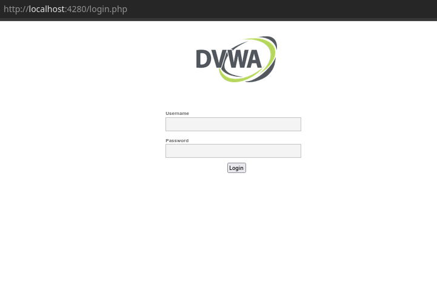
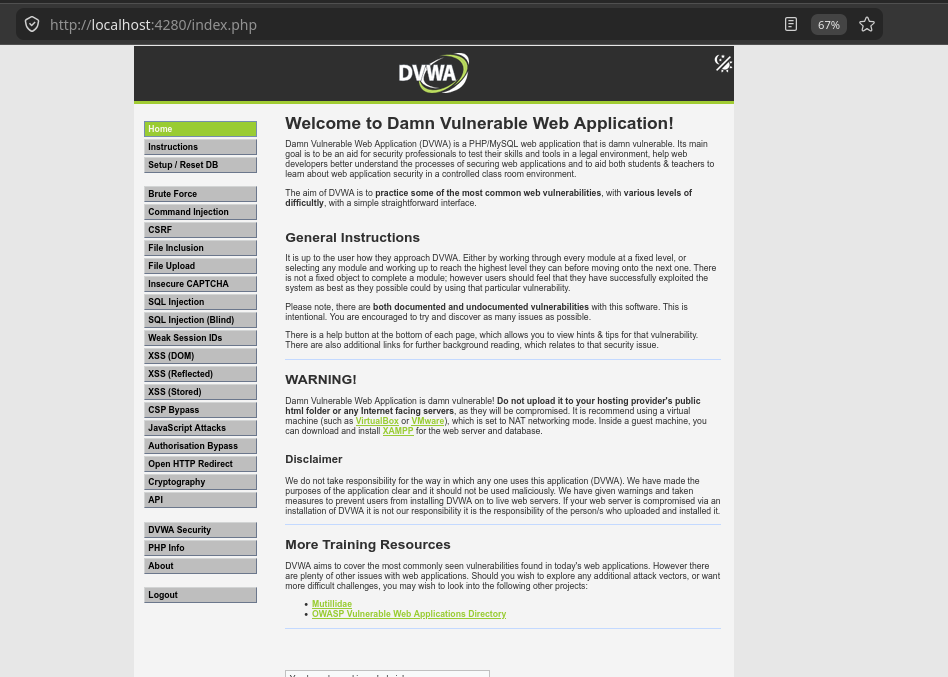

# Deploy & Setting DVWA (Damn Vulnerable Web Application)

## Intro

Setelah sebelumnya sudah melakukan docker setup dan installation, selanjutnya kita akan melakukan implementasi deployment menggunakan docker. Contoh implementasi ini akan menyambung dengan modul berikutnya yaitu mengenai web vulnerability. 
Saat ini kita akan melakukan deployment dan setup sebuah application yang bernama _DVWA - Damn Vulnerable Web Application_.
 
DVWA adalah sebuah web application yang menyediakan environment simulasi yang aman untuk mempelajari web vulnerability dan web penetration. DVWA akan menyediakan berbagai macam sandbox untuk vulnerability yang berbeda-beda dengan tingkat kesulitan yang beragam.

## DVWA Deployment

Untuk praktek deployment docker kali ini, kita akan melakukannya di linux lewat terminal. Pastikan kalian sudah menyiapkan environment yang sesuai (unix/linux) dan jika kalian menggunakan Windows, pastikan kalian telah setup environment linux di system kalian (wsl/virtual machine).
 
Pastikan juga bahwa kalian telah berhasil menginstalasi docker. Untuk tahap instalasi docker dapat dilihat di modul [Docker Setup & Installation](../2.%20Docker%20Setup%20&%20Installation/README.md).
 
Untuk deployment docker dari DVWA kita akan memberikan 2 cara, yaitu cara yang singkat dan cara panjang. Untuk instalasi kalian bisa menggunakan method 1 (method singkat). Lalu kita akan melihat proses dan tahap dari method 1 lebih dalam pada method 2.

### Method 1 : Clone Repository Github

##### 1. Clone Repositori DVWA
 
Pertama, clone repositori DVWA terlebih dahulu, kemudian masuk ke direktori repositori yang sudah di clone
 
```
git clone https://github.com/digininja/DVWA
cd DVWA
```
 
##### 2. Docker Compose Up
 
Lalu, gunakan Docker Compose untuk mendeploy DVWA.
 
```
docker compose up -d
```
 
Docker Compose ini adalah utility dari Docker untuk melakukan otomasi deployment dari beberapa container secara sekaligus, sehingga kita tidak perlu men-setup container tiap-tiap komponen dari sebuah aplikasi (e.g., database, frontend, backend, etc.). 
Compose file (`compose.yml`) yang ada di repositori ini sudah mendefinisikan dua service, yaitu `dvwa` (image `ghcr.io/digininja/dvwa`) dan `db` (image `mariadb:10`), lengkap dengan network dan port mapping-nya.
 
> **Catatan:** DVWA yang berjalan lewat container melakukan listen pada port **4280**, bukan port 80 seperti biasanya. Setelah container berjalan, DVWA dapat diakses lewat `http://localhost:4280`.


### Method 2 : Docker Compose

#### 1. Pull Docker Image
 
Untuk tahap pertama, kita harus pull docker image dari docker hub/registry ke system lokal kita. Jika sudah ada image di system lokal maka docker hanya akan check untuk version terbaru.
 
```
docker pull ghcr.io/digininja/dvwa
```
 
dan selain itu, DVWA memerlukan database MySQL/MariaDB, sehingga
 
```
docker pull mariadb:10
```
 
##### 2. Create Docker Network
 
Docker container itu layaknya sebuah machine-machine individu, sehingga, layaknya dalam Jarkom, perlu kita buat sebuah jaringan (_"network"_) yang menghubungkan antara machine agar mereka bisa berkomunikasi. Di sini bisa kita buat sebuah network `dvwa-net` dengan command berikut:
 
```
docker network create dvwa-net
```
 
##### 3. Create Docker Container
 
Untuk tahap ketiga, kita harus membuat/_create_ container docker dari image yang telah di _pull_/download sebelumnya. Pada tahap ini, container akan disiapkan sesuai dengan konfigurasi yang kita set.
 
```
docker create --network dvwa-net --name dvwa-container -e DB_SERVER=dvwa-mysql -p 4280:80 ghcr.io/digininja/dvwa
```
 
Pada command di atas, kita membuat sebuah _docker container_ menggunakan command `docker create` dengan nama `dvwa-container`, memetakan port host **4280** ke port container **80** (`-p 4280:80`), dari image `ghcr.io/digininja/dvwa`. Kita set `DB_SERVER=dvwa-mysql` karena ketika kita gunakan sebuah network dalam Docker, layaknya sistem DNS, mengarahkan ke tujuan/address di jaringan menggunakan sebuah domain, di mana domain secara default merupakan nama dari container tersebut.
 
> Port host **4280** dipilih (bukan 80) mengikuti default resmi dari image DVWA container, sehingga kita tidak perlu privilege khusus untuk bind ke port di bawah 1024 dan tidak bentrok dengan service lain yang mungkin sudah memakai port 80 di host.
 
Selain itu, MySQL/MariaDB-nya kita perlu buat pula docker containernya. Di sini, di-set beberapa environment variable untuk men-setup default database-nya, hal ini dikarenakan DVWA sendiri memiliki beberapa credential default yang akan digunakannya untuk koneksi ke db.
 
```
docker create --network dvwa-net --name dvwa-mysql -e MYSQL_ROOT_PASSWORD=dvwa -e MYSQL_DATABASE=dvwa -e MYSQL_USER=dvwa -e MYSQL_PASSWORD=p@ssw0rd mariadb:10
```
 
##### 4. Start Docker Container
 
Command berikut self-explanatory, yaitu untuk memulai atau _start_ docker container.
 
```
docker start dvwa-container dvwa-mysql
```
 
Saat kedua docker container berhasil di-_run_, kita dapat mengaksesnya lewat `http://127.0.0.1:4280` atau `http://localhost:4280`.
 

 
##### 5. Managing Container
 
```
docker stop dvwa-container   # atau: docker start dvwa-container
docker stop dvwa-mysql       # atau: docker start dvwa-mysql
```
 
Untuk melihat status seluruh container yang sedang berjalan, gunakan:
 
```
docker ps
```

### Other Method
Bisa melihat dokumentasi resmi dari DVWA di repository githubnya [DVWA](https://github.com/digininja/DVWA)

Terdapat juga cara penginstallan DVWA yang menggunakan XAMPP untuk OS Windows

## Konfigurasi DVWA

Setelah DVWA berhasil terinstall dan dijalankan melalui docker, halaman web DVWA dapat diakses pada `http://localhost:4280` atau `http://127.0.0.1:4280`, jika dibuka akan tampil halaman login

### 1. Login


 
Pada page ini kalian akan input credentials berikut:
 
- Username: `admin`
- Password: `password`

### 2. Database Setup


 
Selanjutnya, pada page `setup.php`, kalian bisa click **'Create/Reset Database'**.
 

 
Setelah reset database berhasil, kalian akan mendapatkan output berikut di bawah page tersebut. Kalian bisa klik login lalu masukkan credentials yang sama di tahap 1.

### 3. Dah beres tinggal hacking


 
Jika berhasil, kalian bisa mengakses web-application DVWA secara full. Selamat explore semua vulnerabilities yang bisa di-_exploit_ di DVWA karena ini akan digunakan untuk materi modul berikutnya.

## Troubleshooting

bisa melihat dokumentasi resmi dari pengembang DVWA di repository githubnya [DVWA](https://github.com/digininja/DVWA)
terdapat section troubleshooting juga pada kasus-kasus umum yang bisa terjadi pada saat konfigurasi DVWA.

## Referensi

1. [DVWA Official Repository — digininja/DVWA](https://github.com/digininja/DVWA)
2. [DVWA Docker Image Packages (GitHub Container Registry)](https://github.com/digininja/DVWA/pkgs/container/dvwa)
3. [Setting-Up Damn Vulnerable Web Application (DVWA) in Docker — polarpwn.gg](https://polarpwn.netlify.app/blog/setting-up-dvwa/)
4. [How to Setup DVWA on Docker — Medium (Nancy Muriithi)](https://medium.com/@Muriithi_nancy/how-to-setup-dvwa-on-docker-a3819ec25f78)
