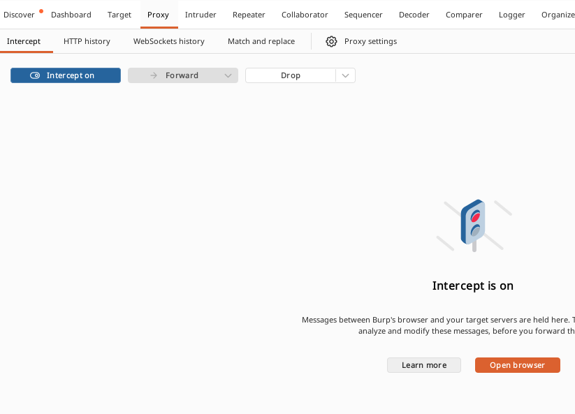
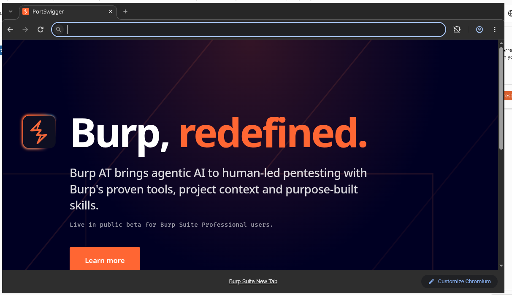
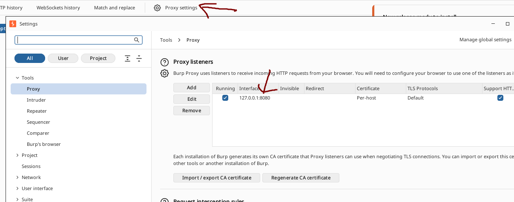
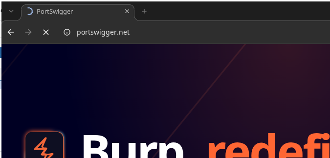
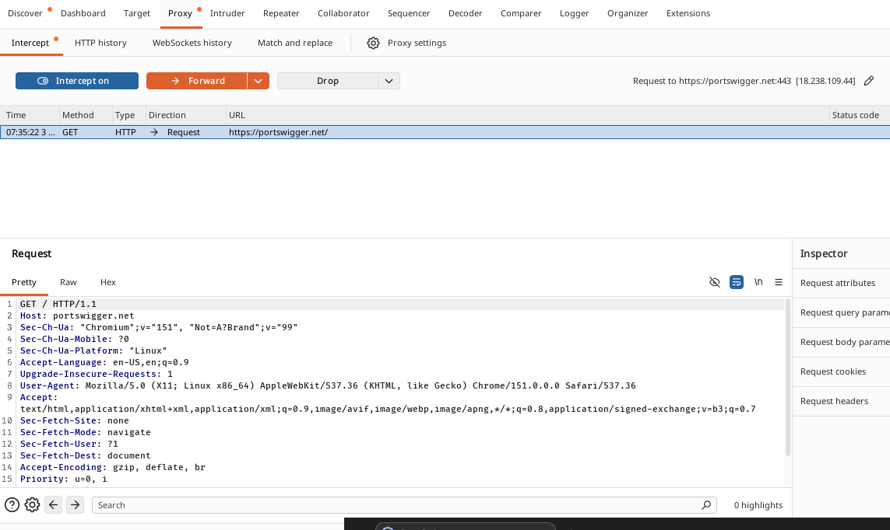
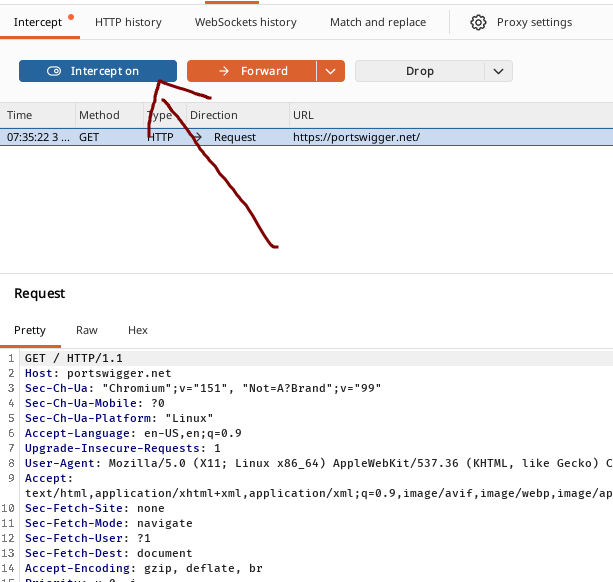
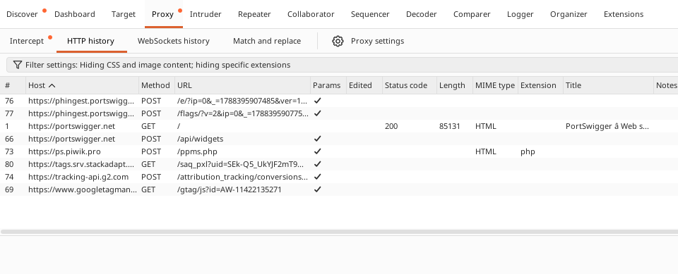

# Burpsuite (Proffesional/Community Ed.)

## Intro

Burp Suite adalah sebuah platform terintegrasi (integrated platform) yang digunakan untuk melakukan pengujian keamanan aplikasi web (web application security testing). Burp Suite dikembangkan oleh **PortSwigger** dan menjadi salah satu tools paling populer di kalangan penetration tester dan bug bounty hunter.
 
Burp Suite bekerja sebagai `intercepting proxy`, yaitu berada di antara browser dan web server, sehingga semua request dan response HTTP/HTTPS yang lewat dapat dilihat, ditahan (intercept), dan dimodifikasi sebelum diteruskan. Beberapa fitur utama yang tersedia di Burp Suite antara lain:
 
1. **Proxy** -> menangkap dan memodifikasi traffic HTTP/HTTPS antara browser dan server
2. **Repeater** -> mengirim ulang request secara manual dengan modifikasi untuk melihat perbedaan response
3. **Intruder** -> melakukan automated attack seperti brute force, fuzzing, dan parameter tampering
4. **Scanner** _(khusus Professional)_ -> melakukan automated vulnerability scanning
5. **Decoder** -> encode/decode data (Base64, URL encoding, hex, dll)
6. **Comparer** -> membandingkan dua data/response untuk melihat perbedaannya
7. **Sequencer** -> menganalisis randomness dari token seperti session ID
<br>

## Perbedaan Professional dan Community Edition
 
Burp Suite tersedia dalam beberapa edisi, namun yang paling umum digunakan adalah _Community Edition_ (gratis) dan _Professional Edition_ (berbayar).
 
| Fitur | Community Edition | Professional Edition |
|---|---|---|
| Proxy, Repeater, Decoder, Comparer, Sequencer | [v] Tersedia | [v] Tersedia |
| Intruder | [v] Tersedia (dengan rate limit / throttling signifikan) | [v] Tersedia (tanpa limit) |
| Scanner (automated vulnerability scan) | [x] Tidak tersedia | [v] Tersedia |
| Kecepatan Intruder | Sangat lambat (dibatasi sengaja oleh PortSwigger) | Cepat, tanpa pembatasan |
| Burp Extensions (BApp Store) | [v] Sebagian besar tersedia | [v] Tersedia penuh |
| Save/Restore project state | [x] Tidak tersedia | [v] Tersedia |
| Collaborator client (out-of-band testing) | Terbatas (menggunakan public server PortSwigger) | Penuh, termasuk private Collaborator server |
| Harga | Gratis | Berbayar (lisensi tahunan, ada trial) |

Sebelum melakukan instalasi, pastikan hal-hal berikut sudah terpenuhi:
 
- **Java Runtime Environment (JRE)** -> Burp Suite versi lama membutuhkan Java untuk berjalan. Untuk versi terbaru, installer dari PortSwigger (`.exe`/`.sh`) biasanya sudah menyertakan JRE bawaan (bundled), sehingga instalasi Java secara terpisah umumnya tidak wajib lagi.
- **Browser** -> disarankan menggunakan Firefox atau Chrome untuk konfigurasi proxy, karena lebih mudah diatur dibanding browser lain.
- **RAM minimal 4GB** (disarankan 8GB ke atas) -> Burp Suite cukup memakan resource terutama saat digunakan untuk scanning atau intruder pada Professional Edition.
- **Koneksi internet** -> dibutuhkan saat instalasi (untuk mengunduh installer) serta saat aktivasi lisensi (Professional Edition).
- **Akun PortSwigger** *(opsional untuk Community, wajib untuk Professional)* -> daftar di [portswigger.net](https://portswigger.net/) untuk mengunduh installer dan mengelola lisensi.
<br>

## Instalsi Burpsuite Community

### Windows

[Link Download Burpsuite Community](https://portswigger.net/burp/downloads)

1. Buka link download di atas, lalu klik `All Platforms` untuk melihat daftar installer, atau biarkan situs mendeteksi OS secara otomatis.
2. Pastikan memilih arsitektur yang sesuai dengan device kalian:
   - Buka `Settings -> System -> About`, cek apakah `System type` menunjukkan `x64-based processor` atau `ARM-based processor`.
   - Untuk sebagian besar device Windows, pilih `Windows (x64)`.
3. Unduh file installer `.exe` (Burp Suite menggunakan **satu installer yang sama** untuk Community Edition dan Professional Edition, edisi akan dipilih/ditentukan saat proses instalasi atau aktivasi lisensi).
4. Ikuti wizard instalasi hingga selesai (klik `Next` pada setiap step, tentukan folder instalasi, lalu `Install`).

### Linux (Ubuntu)

[Link Download Burpsuite Community](https://portswigger.net/burp/downloads)

1. Buka link download di atas, lalu pilih installer untuk Linux.
2. Cek arsitektur device dengan menjalan command berikut:
```bash
uname -m
```
> Jika hasilnya `x86_64`, pilih _Linux (x64)_. Jika hasilnya `aarch64` atau `arm64`, pilih _Linux (ARM)_

3. Download file installer (file nya berupa script shell), kemudian setelah download selesai, beri izin eksekusi pada file installer dengan cara:
```bash
chmod +x /path/to/downloaded/file.sh
```

Kemudian jalankan installer
```bash
/path/to/downloaded/file.sh
```

## Penggunaan Dasar Burpsuite

### Instalasi Sertifikat CA Burp
 
Agar traffic `HTTPS` bisa di-intercept tanpa muncul error sertifikat pada browser, Burp CA certificate perlu dipercaya (trusted) oleh browser yang digunakan.
 
Cara paling mudah adalah menggunakan `Burp's browser` (browser bawaan berbasis Chromium yang sudah terintegrasi dengan Burp):
 
1. Buka tab **Proxy > Intercept**.
2. Klik tombol `Open Browser`. Ini akan membuka Burp's browser, yang **sudah dikonfigurasi otomatis** untuk memakai proxy Burp dan mempercayai sertifikat CA Burp secara default — tidak perlu instalasi manual.
Jika ingin menggunakan browser sendiri (Firefox/Chrome) di luar Burp's browser:

 

 

Jika ingin menggunakan browser sendiri (Firefox/Chrome) di luar Burp's browser:
 
1. Arahkan browser untuk menggunakan Burp sebagai proxy (lihat proxy listener di `Proxy > Proxy settings`, biasanya berjalan di `127.0.0.1:8080`).

 

2. Dengan proxy sudah aktif, buka `http://burp` di browser tersebut.
3. Klik `CA Certificate` untuk mengunduh sertifikatnya.
4. Import sertifikat ke browser:
   - **Firefox:** `Settings -> Privacy & Security -> Certificates -> View Certificates -> Authorities -> Import`, lalu centang `Trust this CA to identify websites`.
   - **Chrome:** import melalui `Settings -> Privacy and security -> Security -> Manage certificates`, lalu tempatkan pada `Trusted Root Certification Authorities`.

### Proxy Intercept

1. Buka tab **Proxy > Intercept**, lalu set toggle menjadi `Intercept is on`.

 

2. Klik `Open Browser` untuk membuka Burp's browser (sudah otomatis dikonfigurasi untuk lewat proxy Burp).

 

3. Coba kunjungi sebuah website, misalnya `https://portswigger.net`, dan perhatikan bahwa halaman tidak langsung ter-load.

 

4. Burp Proxy telah menahan (intercept) request HTTP dari browser sebelum sampai ke server. Request tersebut bisa dilihat pada tab **Proxy > Intercept**, di sana request bisa dipelajari bahkan dimodifikasi sebelum diteruskan.

 

5. Klik `Forward` untuk mengirim request yang tertahan. Klik `Forward` berulang kali untuk meneruskan request-request berikutnya hingga halaman selesai dimuat.

 

6. Karena browser biasanya mengirim banyak sekali request, seringkali kita tidak ingin menahan semuanya. Set toggle menjadi `Intercept is off` agar bisa berinteraksi dengan website secara normal kembali.
7. Semua traffic yang lewat proxy, baik saat intercept aktif maupun tidak akan tetap tercatat di tab **Proxy > HTTP history**. Klik salah satu entry untuk melihat raw HTTP request beserta response dari server. Cara ini lebih praktis untuk menjelajahi website secara normal lalu menganalisis interaksinya belakangan.

 

### Lain-lain

[Dokumentasi Basic Usage](https://portswigger.net/burp/documentation/desktop)

[Testing Workflow](https://portswigger.net/burp/documentation/desktop/testing-workflow)

[Tools Burpsuite](https://portswigger.net/burp/documentation/desktop/tools) 

## Referensi

- [Portswigger - Burp Software](https://portswigger.net/burp)
- [Portswigger - Burp Software Documentation](https://portswigger.net/burp/documentation)
- [Portswigger - Burp Software Download](https://portswigger.net/burp/downloads)
